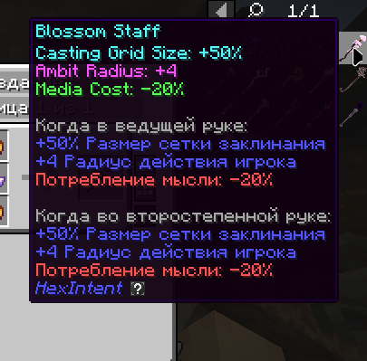
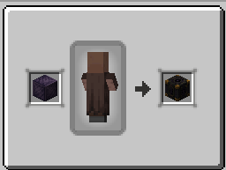

# Предметы
## Посохи:
По своей сути все посохи в HexIntent являются просто скинами друг на друга, и дают одинаковые баффы.

Пример посоха:

 

 
Каждый из них даёт вам: 

- Размер сетки заклинания больше на **50%**
- Радиус каста(стандартный 32) больше на **4 блока**
- Уменьшение цены каста на **20%**

## Блоки
Блоков тут всего 4, но каждый из них очень полезен.

- **Splinter Caster**
- **Hex Reliquary**
- **Mind Vault**
- **Equation Synthesizer**
### Splinter Caster
крафт:

 

Функционал:

