# Виды кнопок

## Intent Button
**Принимает:** `[pattern]`, `text`

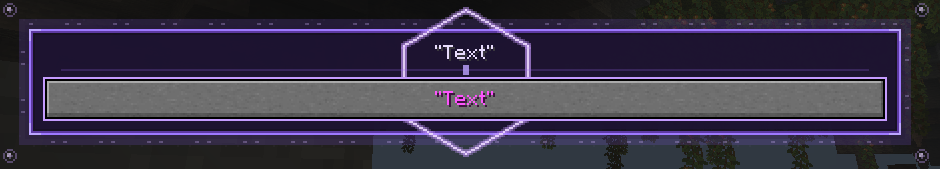

При нажатии выполняет заклинание из **паттерна**.

---

## Intent Input
**Принимает:** `text`

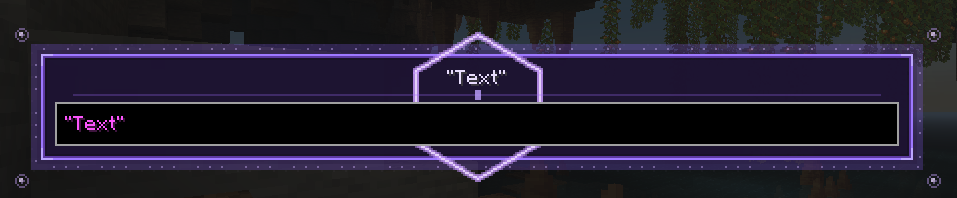

Текстовое поле ввода. По умолчанию содержит значение **text**, но пользователь может ввести любую строку или число. При нажатии кнопки значение передаётся первым **аргументом** — например в *Intent Button*.

---

## Intent Numeric Input
**Принимает:** `num`, `text`

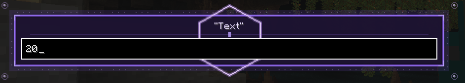

Числовое поле ввода. По умолчанию содержит **num**. Принимает **только числа**. При нажатии кнопки значение передаётся первым **аргументом**.

---

## Intent Slider
**Принимает:** `num(min)`, `num(max)`, `num(default)`, `text`

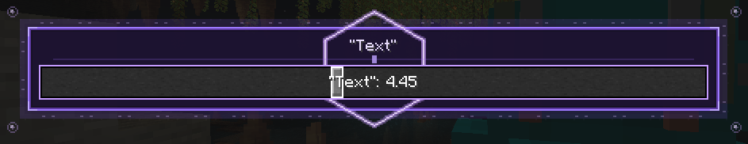

Слайдер в диапазоне от **num(min)** до **num(max)**. По умолчанию установлен на **num(default)**. При нажатии кнопки выбранное значение передаётся первым **аргументом**.

---

## Intent CheckBox
**Принимает:** `bool`, `text`

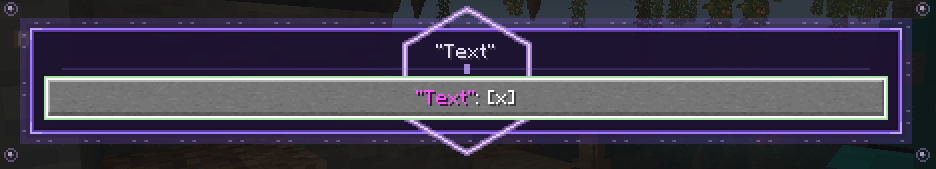

Чекбокс. По умолчанию установлен в **bool**. При нажатии меняет значение на противоположное. При нажатии кнопки передаёт булево значение первым **аргументом**.

---

## Intent Select List
**Принимает:** `[options]`, `num`, `text`, `bool?`

Позволяет выбрать одно или несколько значений из списка. **num** задаёт максимальное количество видимых колонок.

| `bool = true` | `bool = false` |
|---|---|
| 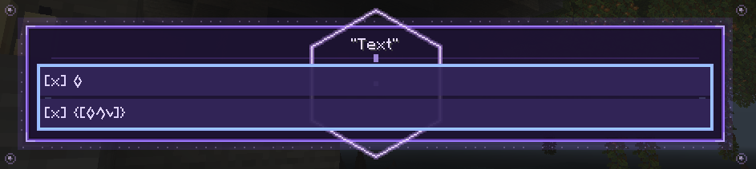 | 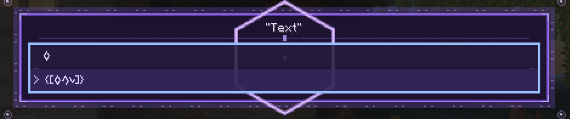 |

При нажатии кнопки выбранные значения передаются первым **аргументом**.

---

## Intent Section
**Принимает:** `text`

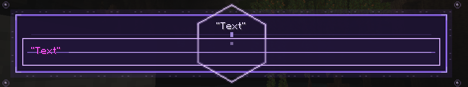

Создаёт неинтерактивную секцию с заголовком **text**.

---

## Intent Dropdown
**Принимает:** `list`, `text`

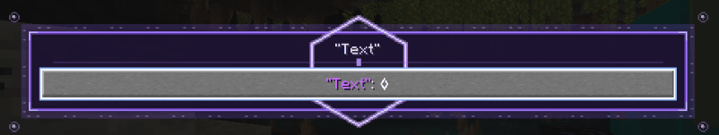

Выпадающий список. Позволяет выбрать одно значение из **list**. При нажатии кнопки выбранное значение передаётся первым **аргументом**.

---

# Виды манифестов

## Manifest List Menu
**Принимает:** `[intents]`, `text`

Создаёт обычное вертикальное меню.

---

## Manifest Grid Menu
**Принимает:** `[intents]`, `text`, `num`

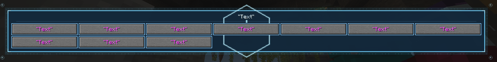

Создаёт меню в виде сетки. **num** задаёт ширину по горизонтали — от **1 до 10**.

---

## Manifest Radial Menu
**Принимает:** `[intents]`, `text`

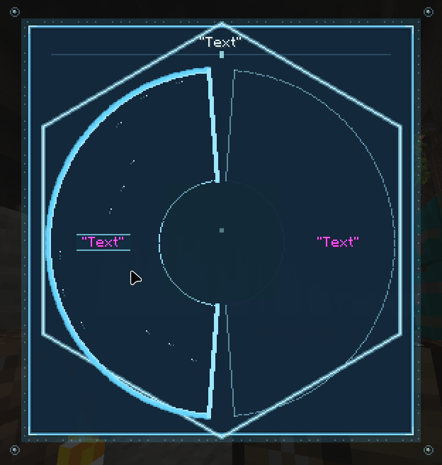

Создаёт радиальное круговое меню. Принимает **только кнопки** — использование других элементов (например *Intent Input*) вызывает **Mishap**.

---

# Другие паттерны

## Open Casting Screen

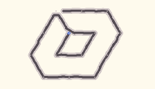

Открывает игроку **сетку каста**. Требует посох в руке. Вызывает **Mishap** при касте из сплинтера, черепашки или других non-player объектов.

---

## Clear Stack

> Временно не работает.